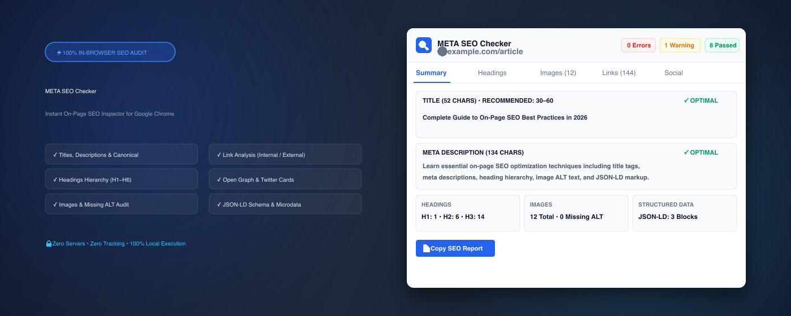
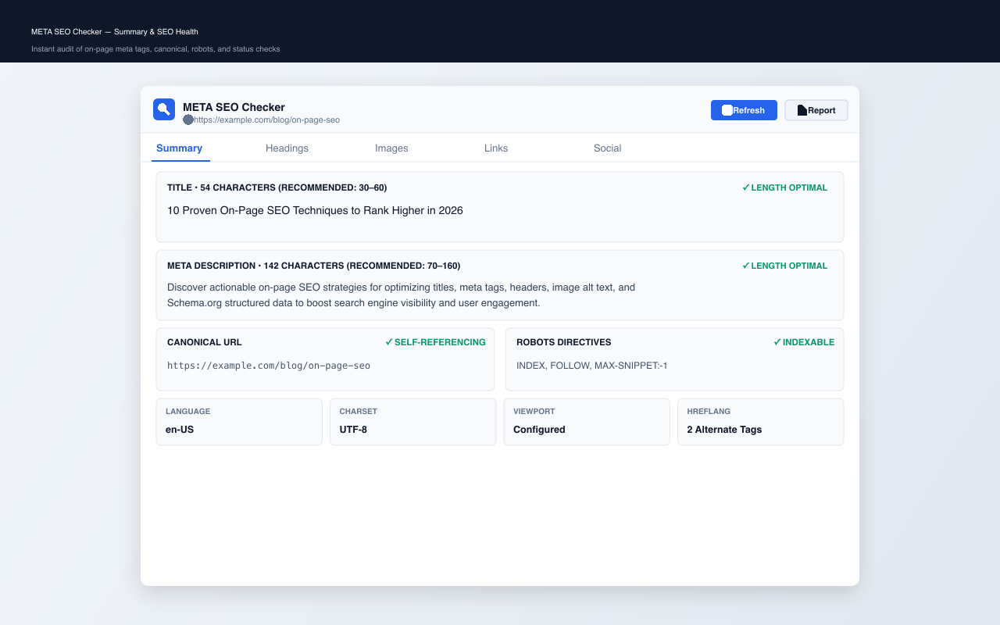
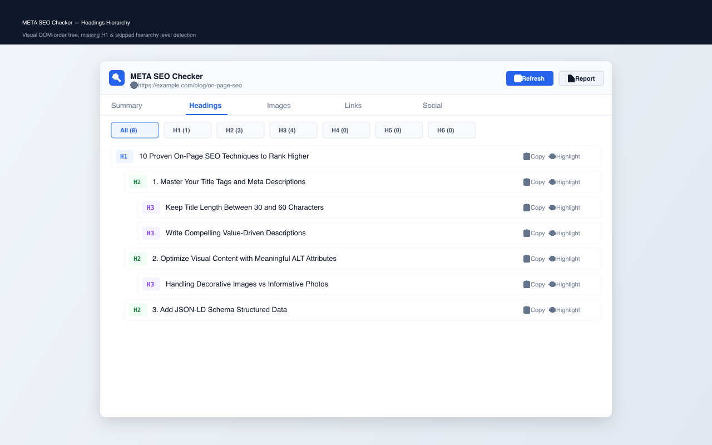
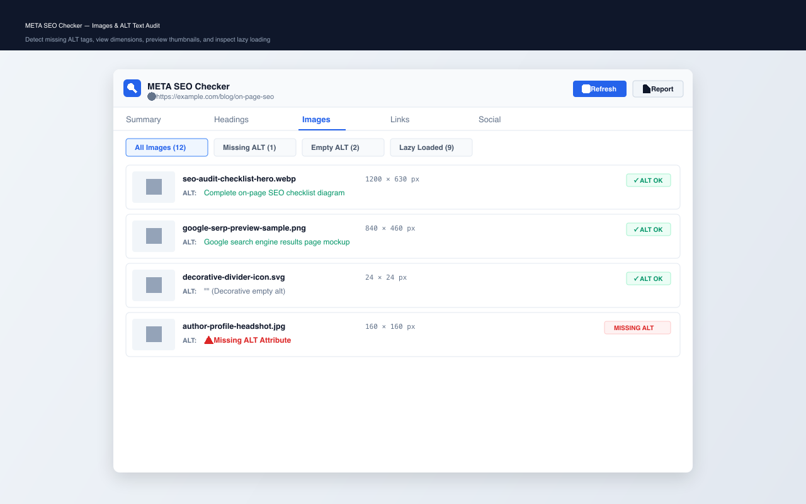
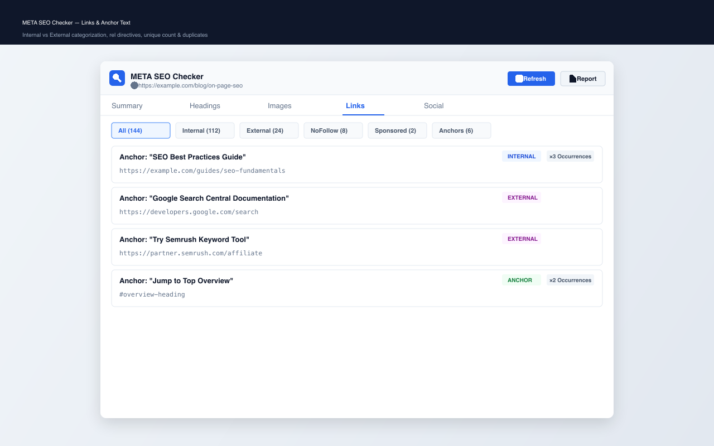
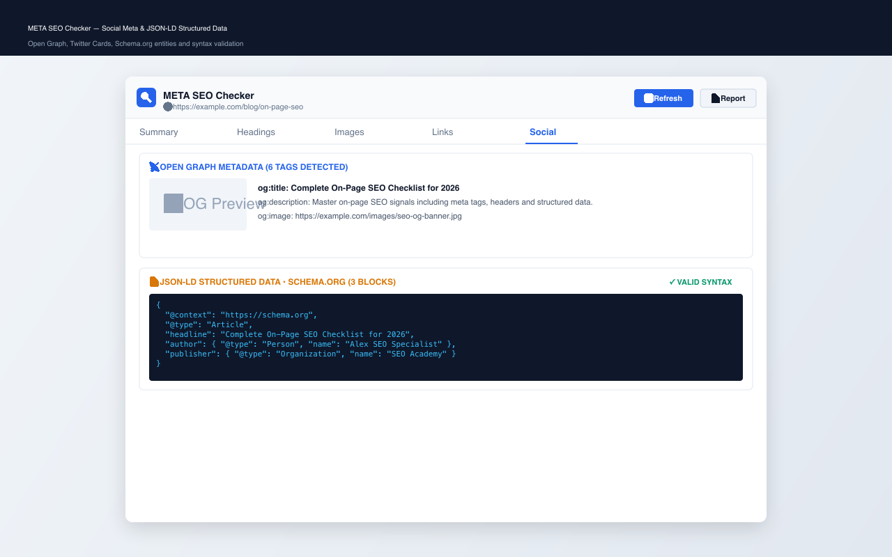
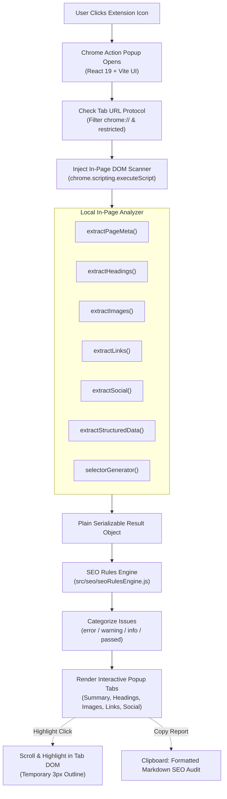

# META SEO Checker

<div align="center">

[](https://chrome.google.com/webstore)
[](https://developer.chrome.com/docs/extensions/mv3/intro/)
[](https://react.dev/)
[](https://vitejs.dev/)
[](LICENSE)
[](#-privacy--security)

---

### Fast, lightweight, and 100% private in-browser Chrome extension for instant on-page SEO inspection and metadata analysis.

</div>
<br />



<br />

---

## 🚀 Key Highlights

- ⚡ **Instant On-Page Analysis**: One-click popup inspection of any active webpage directly in your browser without ever leaving the page.
- 🎯 **SEO Health & Diagnostics**: Instant rule engine calculating `Errors`, `Warnings`, and `Passed` checks with character counts, duplicate tag alerts, and recommended threshold warnings.
- 📑 **Headings Hierarchy Visualizer (H1–H6)**: Complete DOM-order outline tree detecting missing H1, multiple H1s, empty heading tags, and skipped hierarchy levels (e.g. H1 → H3).
- 🖼️ **Image & ALT Attribute Audit**: Complete image inventory with automatic distinction between missing ALT attributes and intentional decorative empty ALTs (`alt=""`), dimensions, and lazy loading detection.
- 🔗 **Comprehensive Link Classifier**: Automatic classification into `Internal`, `External`, `Anchors`, `Mailto`, `Tel`, and `Empty` links with full `rel` directives parsing (`nofollow`, `sponsored`, `ugc`, `noopener`, `noreferrer`) and duplicate occurrences count.
- 📡 **Social & Open Graph Inspection**: Extracts all `og:*`, `twitter:*`, `article:*`, and `fb:*` metadata preserving duplicate keys with interactive social image previews.
- 📄 **JSON-LD Schema & Microdata Parser**: Safe syntax parsing for Schema.org entities (`@context`, `@type`, `@graph`) with formatted code viewer, syntax error isolation, and direct shortcut to **Google Rich Results Test**.
- 👁️ **Interactive On-Page Highlight**: Smoothly scrolls and applies a temporary animated 3px highlight outline to any heading, image, or link on the inspected page.
- 📋 **One-Click Markdown SEO Report**: Generates and copies an executive Markdown SEO summary ready for Slack, GitHub issues, Notion, or client reports.
- 🛡️ **100% Private & Zero-Server**: Runs entirely in the browser with **Zero External APIs**, **Zero Tracking**, and **Zero Server Uploads**.

---

## 📂 SEO Inspection Matrix

| Module / Feature | Inspected Signals | Checks & Heuristics |
| :--- | :--- | :--- |
| **Title Tag** | `<title>`, `document.title`, length counter | Missing title, empty title, multiple title tags, recommended range (30–60 chars). |
| **Meta Description** | `<meta name="description">`, length counter | Missing description, multiple descriptions, recommended range (70–160 chars). |
| **Canonical URL** | `<link rel="canonical">` | Missing canonical, multiple tags, relative URL warning, self-referencing check. |
| **Robots Directives** | `<meta name="robots">`, `<meta name="googlebot">` | `noindex`, `nofollow`, `noarchive`, `nosnippet`, `max-snippet`, `max-image-preview`. |
| **Technical Signals** | `<html lang>`, `<meta charset>`, `<meta name="viewport">` | Language definition, UTF-8 charset declaration, mobile viewport configuration. |
| **Hreflang Alternates** | `<link rel="alternate" hreflang="...">` | Alternate languages count, target URLs, duplicate hreflang entries detection. |
| **Headings Structure** | `<h1>` through `<h6>` in DOM order | Missing H1, multiple H1s, empty text, skipped levels (e.g. H1 jumping to H3). |
| **Images & Assets** | ``, `src`, `srcset`, `alt`, `title`, dimensions | Missing ALT, empty ALT (`alt=""`), missing title, rendered vs natural size, `loading="lazy"`. |
| **Outbound & Inbound Links** | `<a>`, `href`, `rel`, `target`, anchor text | Classification (Internal/External/Anchor/Mailto/Tel), `nofollow`, `sponsored`, `ugc`, unique count. |
| **Open Graph** | `og:title`, `og:description`, `og:image`, `og:url`, `og:type` | Essential tags presence, duplicate property detection, image thumbnail preview. |
| **Twitter / X Cards** | `twitter:card`, `twitter:title`, `twitter:image`, `twitter:site` | Card type validation, image preview, duplicate tags detection. |
| **Structured Data** | `<script type="application/ld+json">`, Microdata, RDFa | JSON syntax validation, `@context` & `@type` verification, `@graph` entity listing. |

---

## 🖼️ Screenshots & Feature Showcase

<div align="center">

### 1. Summary & SEO Health Overview


### 2. Headings Hierarchy Tree & On-Page Highlight


### 3. Images Audit & Missing ALT Detection


### 4. Links Categorization & Rel Directives Tracker


### 5. Social Metadata & JSON-LD Structured Data


</div>

---

## 🏗️ Architecture & Data Flow



---

## 🔒 Privacy & Security

- **100% In-Browser Execution**: All DOM scraping, metadata parsing, and SEO rule evaluation happen strictly inside your browser.
- **Zero Server Uploads**: No page content, URLs, or metadata are ever transmitted to developer-owned or third-party servers.
- **No Analytics / Telemetry**: No tracking scripts, analytics, or behavioral cookies.
- **No Accounts Required**: Use the extension immediately without registering or signing in.
- **Safe Content Handling**: Zero usage of `eval()` or dynamic script execution; JSON-LD is safely parsed via `JSON.parse()` within error boundaries.

---

## ⚙️ Installation & Development Guide

### Prerequisites
- Node.js (v18.0.0 or higher)
- npm (v9.0.0 or higher)

### Setup & Local Development
```bash
# Clone the repository
git clone https://github.com/Solod-S/meta-seo-checker-chrome-extension.git
cd meta-seo-checker-chrome-extension

# Install dependencies
npm install

# Start development preview server
npm run dev
```

### Running Automated Tests
```bash
# Run Vitest test suite
npm test

# Run tests in watch mode
npm run test:watch
```

### Production Build & Packaging
```bash
# Compile production bundle to dist/
npm run build

# Package extension into release ZIP archive
npm run package
```
The compiled extension will be output to `dist/`, and a release-ready archive will be created at `release/meta-seo-checker-v1.0.0.zip`.

---

## 🧩 Loading Unpacked Extension in Chrome

1. Open Google Chrome and navigate to `chrome://extensions/`.
2. Enable the **Developer mode** toggle in the top-right corner.
3. Click the **Load unpacked** button.
4. Select the `dist/` directory from this repository.
5. Navigate to any website (e.g. `https://en.wikipedia.org`) and click the **META SEO Checker** icon in your browser toolbar.

---

## 📜 Chrome Web Store Permissions Justification

| Permission | Purpose & Justification |
| :--- | :--- |
| **`activeTab`** | Granted only upon clicking the extension action icon to inspect the currently active page DOM, meta tags, headings, images, and links. |
| **`scripting`** | Used to execute the local in-page analyzer and to run the temporary DOM element highlight helper on user request. |

---

## 📄 License

This project is licensed under the MIT License — see the [LICENSE](LICENSE) file for details.
